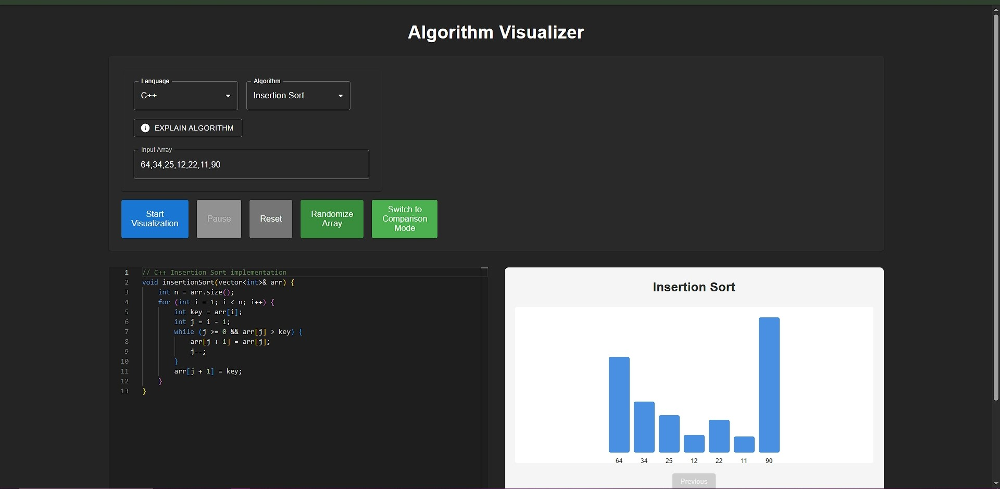
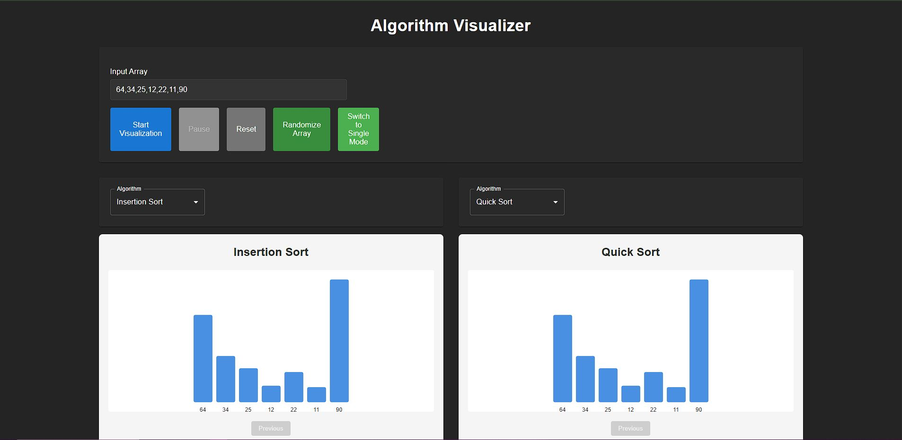

# AlgoViz - Algorithm Visualizer



## Overview

AlgoViz is an interactive web application that visually demonstrates and compares sorting algorithms. Users can input arrays, select algorithms and programming languages, visualize step-by-step execution, and control playback speed. The UI is designed for clarity, interactivity, and educational value.

## Features

- **Multiple Sorting Algorithms**: Visualize Bubble Sort, Quick Sort, Merge Sort, and Insertion Sort
- **Multiple Programming Languages**: View implementations in JavaScript, Python, and C++
- **Interactive Visualization**: Step-by-step execution with adjustable speed
- **Comparison Mode**: Compare two algorithms side-by-side
- **Code Highlighting**: Synchronized code highlighting as algorithms execute
- **Responsive Design**: Works on desktop and mobile devices

## Comparison Mode Screenshot



## Live Demo

[View AlgoViz in action](https://adityathakur9.github.io/AlgoViz)

## Technologies Used

- **Frontend**: React with TypeScript
- **UI Components**: Material-UI (MUI)
- **Code Editor**: Monaco Editor
- **Styling**: CSS
- **Build Tool**: Vite

## Getting Started

### Prerequisites

- Node.js (v14 or higher)
- npm or yarn

### Installation

1. Clone the repository
   ```
   git clone https://github.com/adityathakur9/AlgoViz.git
   cd AlgoViz
   ```

2. Install dependencies
   ```
   npm install
   ```

3. Start the development server
   ```
   npm run dev
   ```

4. Open your browser and navigate to `http://localhost:5173`

## Usage

1. Select a sorting algorithm from the dropdown menu
2. Choose a programming language (JavaScript, Python, or C++)
3. Use the "Randomize" button to generate a random array
4. Click "Run" to start the visualization
5. Use the speed slider to adjust the animation speed
6. Toggle between single and comparison modes using the mode switch

## Contributing

Contributions are welcome! Please feel free to submit a Pull Request.

## License

This project is licensed under the MIT License - see the LICENSE file for details.

## Acknowledgments

- Inspired by various algorithm visualization tools
- Built with React and TypeScript 